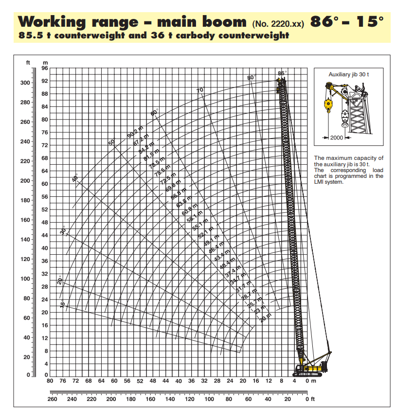
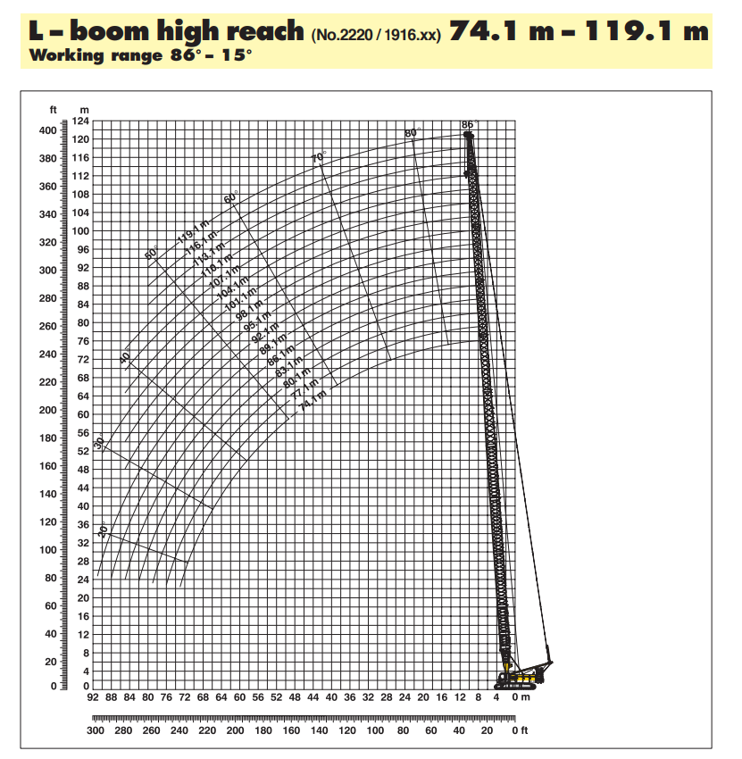
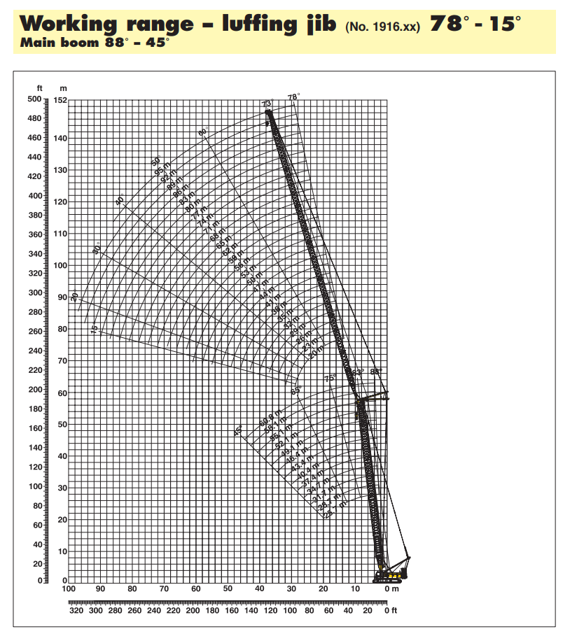

# 🏗️ Crane Load Capacity Analyzer (LR 1280)

---

## 🚀 Overview

Crane load charts are essential for safe lifting operations, but interpreting them manually is often complex, error-prone, and time-consuming.

This project introduces an **interactive web-based tool** that simplifies crane load calculations using real-world engineering data.

Built using **Python, Tabula, Pandas, and Streamlit**, the application converts traditional crane charts into a **smart, intuitive, and user-friendly system**.

---

## 🎯 Problem Statement

Manual crane load chart interpretation leads to:

* ❌ Complex and difficult calculations
* ⚠️ Risk of incorrect capacity estimation
* ⏱️ Time-consuming decision-making

👉 This tool eliminates these challenges by providing **instant, accurate lifting capacity results**.

---

## ✨ Key Features

* 🏗️ Supports multiple crane configurations:

  * Main Boom
  * L-Boom (High Reach)
  * Luffing Jib

* ⚡ Real-time lifting capacity calculation

* 📊 Uses actual crane load chart datasets

* 🎛️ Interactive UI built with Streamlit

* 🔍 Supports multiple parameters:

  * Radius
  * Boom Length
  * Angle / Jib Length

---

## 🖥️ User Interface

### UI – Workflow 1


### UI – Workflow 2


---

## 🧠 How It Works

### 🔹 Workflow 1 (Configuration-Based)

1. User selects crane configuration
2. Inputs:

   * Radius
   * Boom Length
   * Angle / Jib Length
3. System maps inputs to structured dataset (`data.pkl`)
4. Returns **maximum safe lifting capacity**

---

### 🔹 Workflow 2 (Height-Based)

1. User selects crane configuration
2. Inputs:

   * Radius
   * Height
3. System processes dataset
4. Returns **safe lifting capacity across configurations**

---

## 📊 Data Source

* Data extracted from official crane technical documents using **Tabula**
* Cleaned and structured using **Pandas**
* Stored as a serialized dataset (`data.pkl`) for fast access

---

## 🖼️ Reference Charts





---

## ⚙️ Tech Stack

* **Python**
* **Streamlit**
* **Pandas**
* **Tabula (PDF table extraction)**

---

## ▶️ Run Locally

```bash
git clone https://github.com/SURYA22508/crane-load-capacity-analyzer.git
cd crane-load-capacity-analyzer
pip install -r requirements.txt
streamlit run app.py
```

---

## 💡 Real-World Applications

* 🏗️ Construction planning
* ⚙️ Crane operation safety
* 📐 Load estimation
* 🎓 Engineering education

---

## 🚀 Future Enhancements

* 📊 Data visualization (graphs & trends)
* 🌐 Deploy as a live web application
* ⚠️ Smart overload warning system
* 🤖 AI-based crane recommendation

---

## 👨‍💻 Author

**Surya Vardhan**

---

## ⭐ Support

If you found this project useful, consider giving it a ⭐ on GitHub!

---

## 📌 Final Note

This project demonstrates how **engineering + data + software** can be integrated to solve real-world industrial problems efficiently.
